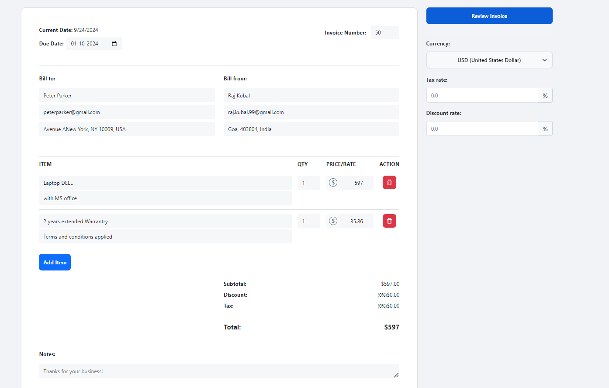
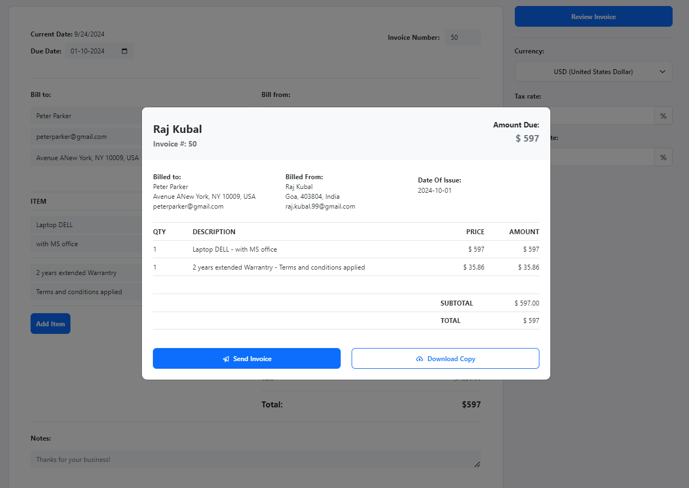
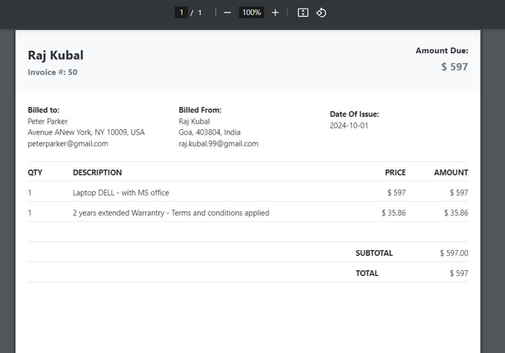

# Invoice Generator - React App
 

An Invoice creator project built with React. Add itemized items, configure quantity, prices, tax rates and discounts. Download Invoice as PDFs to your device. Uses [jspdf-react](https://www.npmjs.com/package/jspdf-react) to capture the data from the modal and covert it from canvas -> pdf.

### Live Demo
https://invoice-generator-psi-three.vercel.app/

### Screenshots




### Installation

```
git clone https://github.com/raj-kubal99/Invoice-Generator

npm install

npm start / npm run build
```

### To-Do
- [x] Finish parsing data into Preview Modal

- [x] Currency Picker

- [x] Calculate Tax and Discounts

- [ ] Store invoices in Firebase DB


### Meta

Raj Kubal – [raj.kubal.99@gmail.com](https://raj.kubal.99@gmail.com)
